### Our new Citizen Science Project

<div style="text-align:center;">
  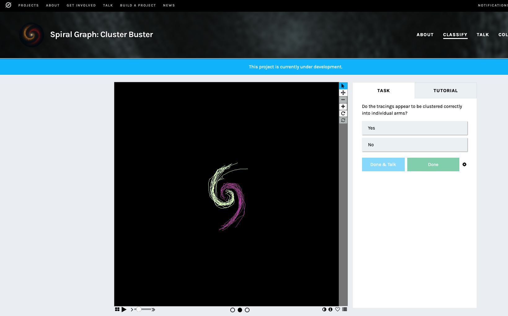
</div>


---

### How did we end up here?

::: {.columns}
::: {.column width="50%"}
<div style="font-size: 70%;">
::::{.incremental .smaller}
- Looking for galactic `intermediate mass black holes`
- `Pitch angle` is the key parameter, correlates with black hole mass
  <div style="text-align:center;">
    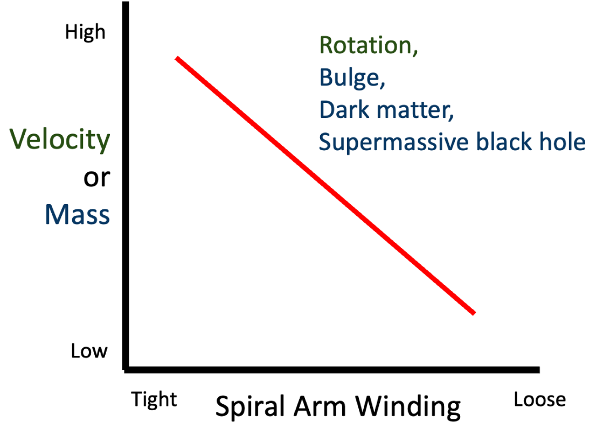
  </div>
- So-called `global pitch angle` value might be misleading for galaxies with multiple arms
::::
</div>
:::
::: {.column width="50%"}
<div style="font-size: 75%;">
::::{.incremental .smaller}
- `Arm clustering` is a way to identify individual arms
  <div style="text-align:center;">
    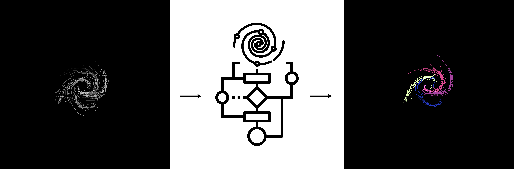
  </div>
- We need to do this for thousands of galaxies!
- **To scale up, we need a way to identify individual arms automatically**
- AI can help us with this!
::::
</div>
:::
:::

--- 

### Arm Clustering

<div style="text-align:center;">
  
</div>


---

### Training on good and bad clustering!

<div style="text-align:center; padding-top: 0.2em;">
  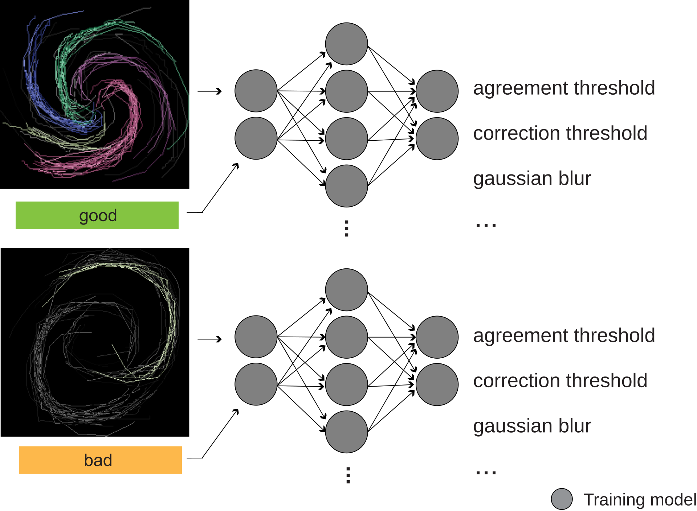
</div>

---

### Predictions for `new` tracings!

<div style="text-align:center; padding-top: 1em;">
  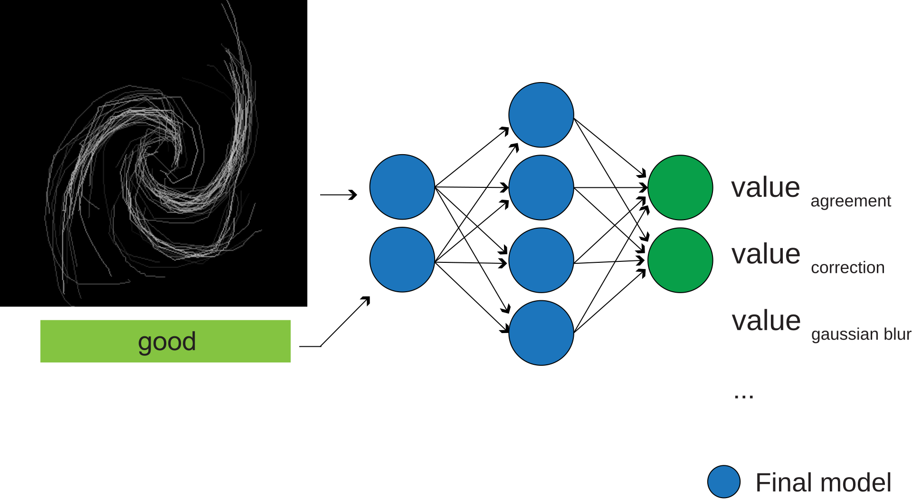
</div>

---

#### So far, we have manually set hyperparameters

<div style="text-align:center; padding-top: 0.2em;">
  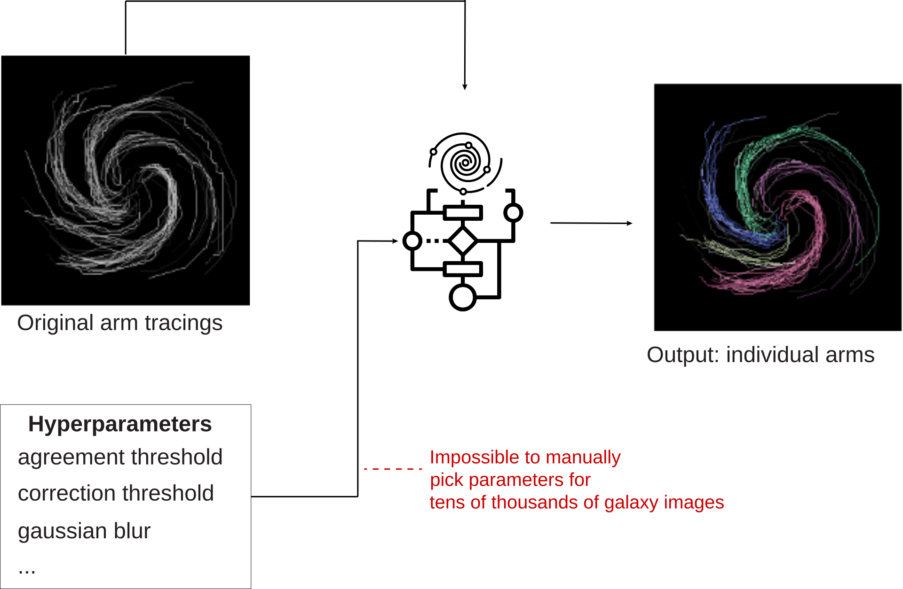
</div>

---

#### Meta-model for our hyperparameters!

<div style="text-align:center; padding-top: 2em;">
  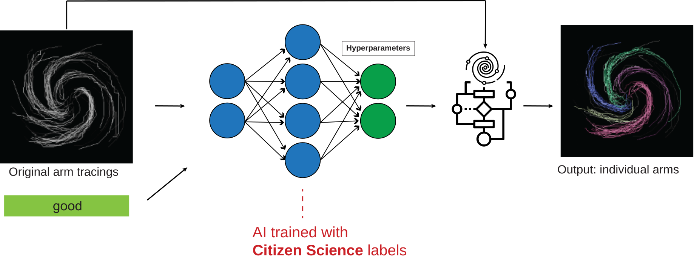
</div>


---

### Final Remarks

<div style="font-size: 85%;">
::::{.incremental}
- `Spiral Graph: Cluster Buster` lives in Zooniverse
- Currently at demo phase
  - Instructions are complete
  - Tested with multiple volunteers
- Supported by <a href="https://zenodo.org/records/15882378" target="_blank">NASA Citizen Science Seed Funding Program</a>
  

::::
</div>

---


## Questions?

[https://go.ncsu.edu/cluster-buster](https://www.zooniverse.org/projects/abiswas/spiral-graph-cluster-buster)

<div style="text-align:left; margin: 1rem 0;">
  
</div>

<p class="thank-you-inline">THANK YOU</p>

<a href="mailto:alptezbasaran@ncsu.edu">alptezbasaran@ncsu.edu</a>

::: hidden
```{=html}
<script>
  document.addEventListener('DOMContentLoaded', () => {
    const title = document.querySelector('.reveal .slides section .title, .reveal .slides section h1, .reveal .slides section h2');
    const workshop = title ? title.textContent.trim() : 'Workshop';
    document.body.setAttribute('data-workshop', workshop);
  });
</script>
```
:::

```{=html}
<style>
/* Hide deck chrome only when the fullscreen iframe slide is active */
body.hide-chrome .reveal .slide-number { display: none !important; }
body.hide-chrome .reveal .footer.footer-default { display: none !important; }
body.hide-chrome::before { display: none !important; }
body.hide-chrome .reveal .controls,
body.hide-chrome .reveal .progress { display: none !important; }
body.fsimg .reveal .slide-number { display: none !important; }
body.fsimg .reveal .footer.footer-default { display: none !important; }
body.fsimg::before { display: none !important; }
/* Hide title-slide logos ::before from theme when fsimg active */
body.fsimg .reveal .slides section:first-child::before { display: none !important; }
/* Also hide any slide-logo element */
body.fsimg .reveal .slide-logo { display: none !important; }
body.no-logos .reveal .slides section::before { display: none !important; }
body.no-logos .reveal .slide-logo { display: none !important; }
</style>
```

---

```{=html}
<section data-background-iframe="fullscreen.html" data-background-interactive data-state="fsimg"></section>
```

---

#### Pitch Angle correlates with BH mass

:::: {.columns}
:::: {.column width="50%"}
<div style="font-size: 70%;">
- Measure degree of winding (pitch angle) via P2DFFT
  - <a href="https://treuthardt.github.io/P2DFFT" target="_blank">treuthardt.github.io/P2DFFT</a>
- Pitch angle correlates with:
  - Maximum rotation velocity
  - Bulge stellar mass
  - Dark matter content
  - Supermassive black hole (SMBH) mass
</div>
::::
:::: {.column width="50%"}
<div style="font-size: 70%;">
- Origins of SMBHs are still unknown
  - Stellar BH rapidly consuming material?
  - Merging clusters of stellar BHs?
  - Collapse of large gas clouds?
<div style="text-align:center; margin-top: 0.5rem;">
  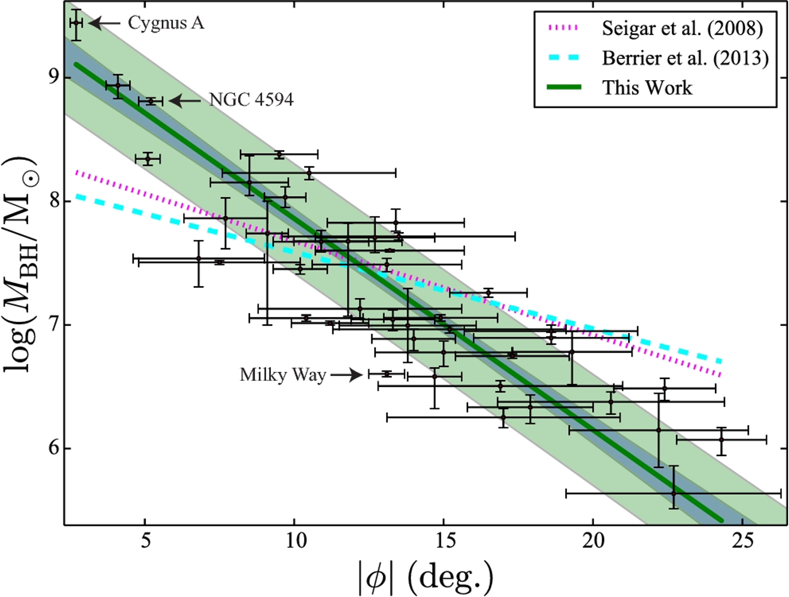
</div>
::::
::::

---

#### Spiral Graph

:::: {.columns}
:::: {.column width="25%"}
<div style="text-align:center; margin-top: 0.5rem;">
  <strong style="font-size: 70%;">Untraceable</strong><br>
  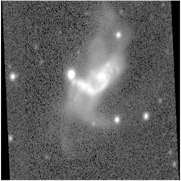
</div>
::::
:::: {.column width="25%"}
<div style="text-align:center; margin-top: 0.5rem;">
  <strong style="font-size: 70%;">Traceable</strong><br>
  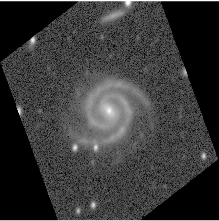
</div>
::::
:::: {.column width="50%"}
<div style="text-align:center; margin-top: 0.5rem;">
  <strong style="font-size: 70%;">Interactive Tracing</strong><br>
  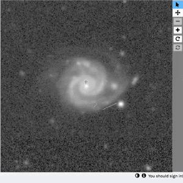
</div>
::::
::::

:::: {.columns}
:::: {.column width="50%"}
<div style="font-size: 50%;">
- Identify the center galaxy
  - (a)Smooth, merging, or untraceable?
  - (b)Structured and not merging?
- If (b), trace the structure
</div>

::::

:::: {.columns}
:::: {.column width="25%"}
<div style="text-align:center;">
  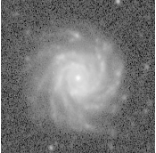
  <div style="font-size: 50%;">Original Galaxy</div>
</div>
::::

:::: {.column width="25%"}
<div style="text-align:center;">
  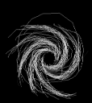
  <div style="font-size: 50%">Traced Arms</div>
</div>
::::
::::
